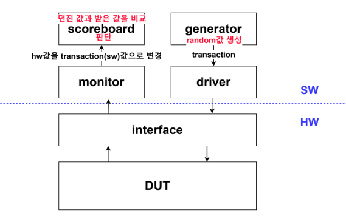

오늘 할 것

- adder 검증 (system verilog 이용해서)

### system verilog 검증 구조

오늘은 초록색 네모 박스 안에 있는 것만 해볼 것

transcation은 객체, 물체.
"객체와 객체간의 상호작용"

- testbench
  - env
    - generator:
      transaction을 생성하는 class  
      random transaction 을 만든 이후 mail box에 집어 넣음  
      -> generator class가 mail box의 요소들도 알아야 한다.  
    - driver: transaction을 sw 로 바꿔서 interface로 넣어준다?  
    - mailbox: 공유 메모리 (Queue)
      임시공간(mailbox)에 generator가 transaction을 넣어주면,  
      driver가 transaction을 꺼내서 hw 언어?로 바꾼다음 interface로 보내줌
  - interface: hw와 sw 를 연결해주는 통로
  - DUT: 실제 hw core

-function과 task의 차이점
function은 return값이 존재하고 task는 return 값이 없다.
