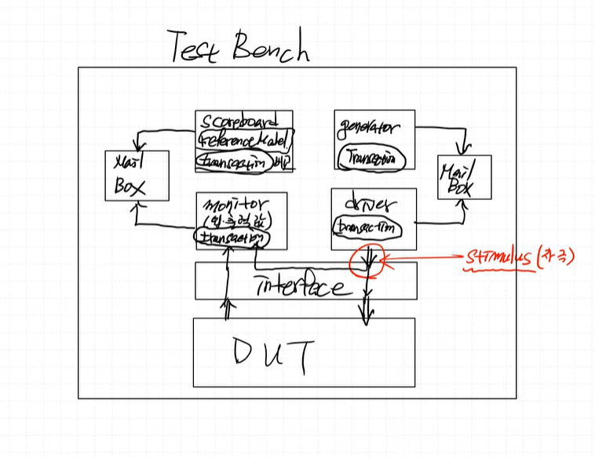

### 과제: FND IP를 APB bus에 붙이기


- enable 신호가 1일 때만 FND가 동작
- FMR : 4bit 짜리, 어떤 FND를 켤건지 정함
- FDR: 4bit 짜리, 0~9까지의 숫자를 표시 가능

FCR: IP의 enable 신호 > FND를 on/off 하는 신호
FMR: FND COM Register
FDR: FND Data Register


[MY IP]
0x00: FCR 
0x04: FMR
0x08: FDR


### systemVerilog를 통해 검증! (FND 만!!, CPU도 하기에는 너무 복잡하대)

**[SystemVerilog Test구조]**



**env**

- **generator**
    - transaction 값을 만들어 mail box에 넣어둠

- **driver** 
    - mail box에 transaction 이 있다면 갖고와서 interface에 넘김


- **monitor** 
    - 입출력 값들을 monitoring 함
    - DUT의 입력값, 출력값을 둘 다 모니터링함
    - 이 입출력 값을 transaction에 저장하고 이 transaction을 mailbox에 넣음

- **scoreboard** 
    - mailbox를 감시하고 있다가 transaction이 들어오면 땡겨옴
    - reference model 값과 transaction 값을 비교함


**DUT**
- Test하기 위한 IP!

**Interface**
- DUT와 env를 연결해주는 역할을 함

> mailbox라는 class는 systemVerilog에서 제공하는 class이다!

복잡한 IP일수록(Test 해야하는 Data가 많을 수록) 간단한 testbench 구조는 test 하기 힘들다.

**[이와 같은 systemVerilog Testbench 구조를 사용하는 이유]**
**RANDOM** 값 생성이 편리하기 때문에!
TRANSACTION을 RANDOM하게 만들 수 있음!!
비트 수가 많을수록 손으로하기 힘들다. RANDOM하게 만들 수 있는 구조가 필요하다!


> 캡슐화 : class의 특징
변수와 함수를 하나로 묶어준다


random 값을 만들 때 제약을 줄 수 있다!
constraint 사용

```verilog
    constraint c_paddr {PADDR inside {4'h0, 4'h4, 4'h8};} //이 중에 하나만 random 값으로 쓰겠다
    constraint c_wdata {PWDATA <10;}
```


-----


```verilog
    transaction fnd_tr;  //heap 영역에 transaction 메모리 공간 생성 
    fnd_tr = new(); //stack 영역에 fnd_tr 메모리 공간 생성, heap 영역에 instance 생성됨
    //new(): 해당 instance의 주소, reference 값
    //fnd_tr은 handler.
    // handler는 heap 영역에 있는 instance를 가리키고 있다. (첫번째 주소), & 자료형의 크기만큼 heap 영역에 메모리 공간을 할당한다.(transaction class의 크기만큼)

    if(!fnd_tr.randomize()) $error("randomize failed"); 
    // .randomize() : random 값을 생성하는 함수 -> if 이전에 이 함수가 먼저 실행되어 random 값이 먼저 생성된다.
    // 이후 if 문이 실행되어 randomize가 성공했는지 실패했는지 확인한다.
    // randomize()가 실패하면 프로그램이 멈춘다.
```

mailbox는 queue 형태로 되어있다.


위 그림은 아래 코드를 시각화 한것이다
```systemverilog
class envirnment;
    mailbox #(transaction) Gen2Drv_mbox;

    generator fnd_gen;
    driver fnd_drv;

    event gen_next_event;

    function new(virtual APB_fnd_Controller fnd_intf);
        Gen2Drv_mbox = new();
        this.fnd_gen = new(Gen2Drv_mbox, gen_next_event);
        this.fnd_drv = new(Gen2Drv_mbox, gen_next_event, fnd_intf);
    endfunction
endclass
```

stack은 handler (실제 instance화 된 메모리 공간을 가리키는 포인터)
heap은 실제 intance화 된 object의 공간, 자료형의 크기만큼 heap 공간을 차지한다.


```systemverilog
    task run(int count);
        fork
            fnd_gen.run(count);
            fnd_drv.run();
            fnd_mon.run();
            fnd_scr.run();
        join_any
    endtask  //run
``` 
fork join 안에 있는 함수들은 동시에 동작한다.