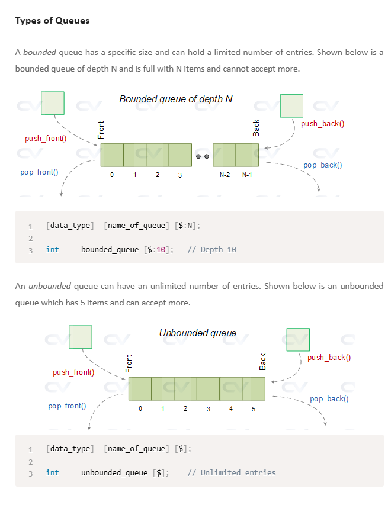

SysVerilog 문법


### Queue


```verilog
    int 	bounded_queue [$:10]; 	// Depth 10
```
크기가 10개인 queue 가 생성된다.

```verilog
    int 	unbounded_queue [$]; 	// Unlimited entries
```
넣는 만큼 queue의 크기가 늘어난다.


- queue function
1. push_back() : queue의 뒤에 값을 추가한다.
2. push_front() : queue의 앞에 값을 추가한다.
3. pop_back() : queue의 뒤에 값을 삭제한다.
4. pop_front() : queue의 앞에 값을 삭제한다.

검증할 때 많이 쓴다고함


### systemverilog constraint

가중 분포

```verilog
    constraint c_wdata {PWDATA dist {0:10, 1:20, 2:30, 3:40, 4:50};} //0이 나올 확률이 제일 높고 4가 나올 확률이 제일 낮다.
```

```verilog
    constraint c_wdata {PWDATA dist {0:/10, [1:5]/50};} 
```
