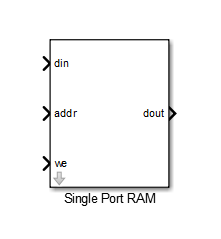
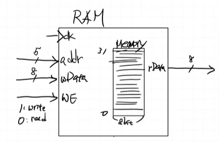
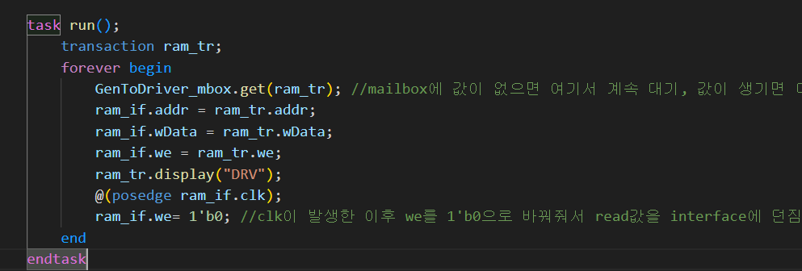
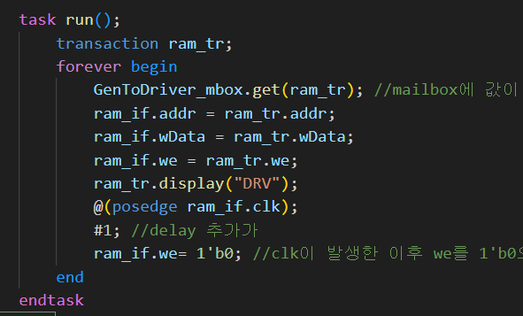
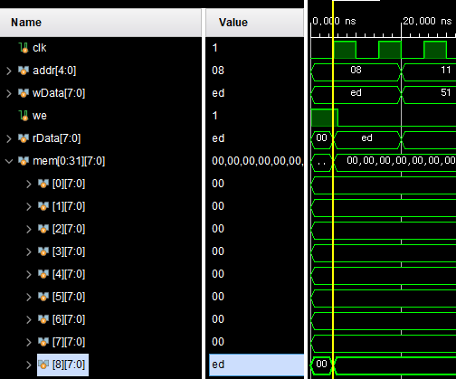
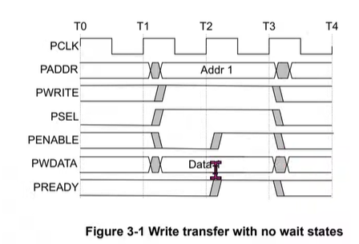
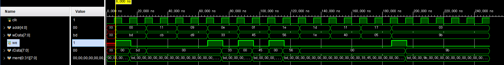

### single port RAM
> 하나의 port만 사용

- addr: 5bit(메모리 주소가 2**32-1개 있음) 
- wdata 8bit
- we: 1> write, 0> read
- rdata 8bit

> 이게 하나의 interface 구조

- raise condition 발생
`ram_if.we=ram_tr.we`와 `ram_if.we=1'b0` 둘이서 raise condition 발생함

we이 clk posedge 에 동시에 0으로 떨어지는게 아니라 조금의 delay이후에 0으로 떨어져야 한다.(ram에 write 동작을 기다려야한다.)

delay 추가

> AMBA APB datasheet을 확인해봐도 clk edge에서 바로 signal 을 change 하지 않음

clk posedge이후 약간의 delay후에 변화가 생긴다.
raise condition을 방지하기 위함

> 애초에 input output에 default delay 주기
clocking block 이용
input, output이 나중에 나간다.

> clocking block 적용이후

